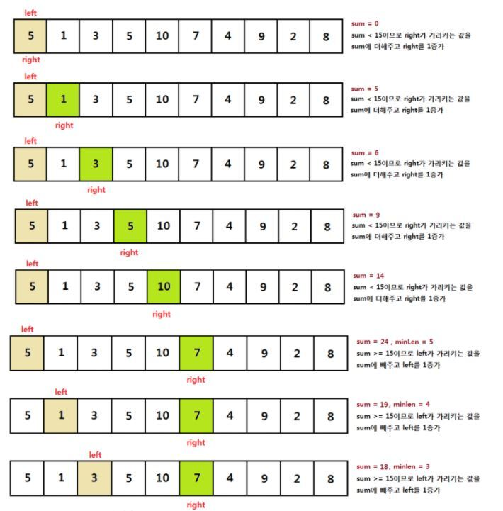

## 개념
투 포인터 알고리즘(또는 Two Pointer 알고리즘)은 주로 배열 또는 리스트와 같은 순차 데이터 구조에서 두 개의 포인터를 사용하여 특정한 조건을 만족하는 부분 구간을 찾는 데 사용되는 효율적인 알고리즘입니다. 이 알고리즘은 주로 선형 시간 복잡도를 가지며, 특히 정렬된 배열에서 사용될 때 매우 유용합니다.

두 개의 포인터 중 하나는 시작 부분에서 시작하고, 다른 하나는 끝 부분에서 시작합니다. 그런 다음 두 포인터를 이용하여 배열을 순회하면서 원하는 조건을 만족하는 부분 구간을 찾거나, 원하는 값을 찾는 등의 작업을 수행할 수 있습니다. 보통 포인터를 이동하면서 조건을 만족하는 부분을 확장하거나 축소해 나가는 방식으로 알고리즘이 동작합니다.

예를 들어, 배열에서 합이 특정한 값을 가지는 부분 배열을 찾는 문제를 생각해보겠습니다. 두 포인터를 배열의 시작과 끝에 두고, 합이 특정한 값을 가지지 않을 때는 더 작은 값을 가지는 포인터를 앞으로 이동하고, 합이 특정한 값을 넘을 때는 더 큰 값을 가지는 포인터를 뒤로 이동하여 부분 배열을 구간을 조절해 나가면서 합이 원하는 값과 일치하는 부분을 찾을 수 있습니다.

투 포인터 알고리즘은 배열 또는 리스트와 같은 순차 데이터 구조를 다룰 때 유용하며, 특히 정렬된 데이터에서 작동할 때 선형 시간 복잡도를 가지므로 효율적입니다.




## 시간복잡도
매 루프마다 항상 두 포인터 중 하나는 1씩 증가하고 각 포인터가 n번 누적 증가해야 알고리즘이 끝납니다. -> 각각 배열 끝에 다다르는데 
O(N) 이라 둘을 합해도 여전히 O(N) 입니다.

## 관련 코딩테스트 문제
[연속된 부분 수열의 합](https://onethingchanged.github.io/posts/dailycode-03/)

## 예제 코드 (C++)
```cpp
vector<int> solution(vector<int> sequence, int k) {
    int size = sequence.size();
    int maxSum = 0;
    int end = 0;
    int range = size;
    vector<int> answer(2);
    for (int i = 0; i < size; ++i)
    {
        while (maxSum < k && end < size)
        {
            maxSum += sequence[end];
            end++;
        }
        if (maxSum == k && end - 1 - i < range)
        {
            answer[0] = i;
            answer[1] = end-1;
            range = end - 1 - i;
        }
        maxSum -= sequence[i];
    }
    return answer;
}
```

<script src="https://utteranc.es/client.js"
        repo="OneThingChanged/OneThingChanged.github.io"
        issue-term="pathname"
        label="utterances"
        theme="github-dark"
        crossorigin="anonymous"
        async>
</script>
