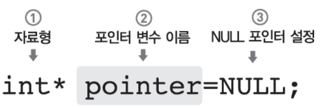
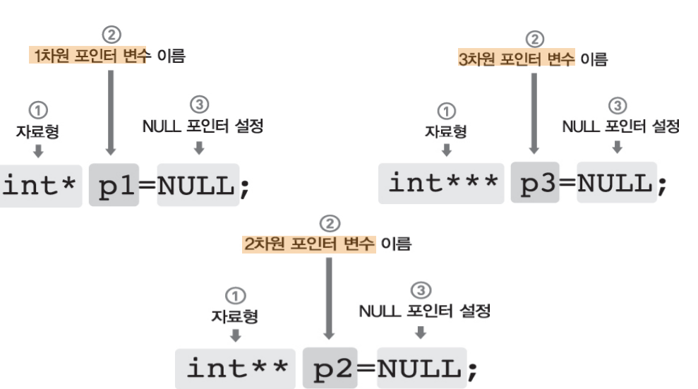
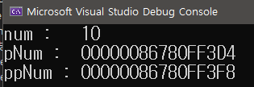
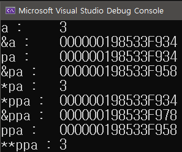

### 1. 포인터란 무엇인가?

포인터는 메모리 주소를 저장하는 변수입니다. C++에서는 데이터가 메모리에 저장되며, 각 데이터는 고유한 메모리 주소를 가집니다. 포인터는 이러한 메모리 주소를 가리키는 역할을 하며, 이를 통해 간접적으로 데이터에 접근할 수 있습니다.

### 2. 포인터의 선언 및 초기화

C++에서 포인터를 선언하는 방법은 아래와 같습니다:

```c++
cppCopy code
int* ptr;
```

이 코드는 `int` 타입의 데이터를 가리키는 포인터 `ptr`을 선언합니다. 포인터를 초기화하는 방법은 다음과 같습니다:

```c++
cppCopy codeint value = 5;
int* ptr = &value;
```

여기서 `&` 연산자는 변수 `value`의 메모리 주소를 반환합니다. `ptr`은 이제 `value`의 주소를 가리키고 있습니다.



### 3. 포인터를 통한 데이터 접근

포인터를 사용하여 데이터에 접근하려면, 역참조 연산자 `*`를 사용합니다. 예를 들어:

```c++
int num = 10;

//int형 포인터 변수
int* pNum = &num;
    
cout << "num :\t" << num << endl;
cout << "pNum :\t" << pNum << endl;
```

이 코드는 `ptr`이 가리키는 주소의 값을 출력합니다.


### 4. 포인터와 배열

배열과 포인터는 밀접한 관련이 있습니다. 배열 이름은 배열의 첫 번째 요소를 가리키는 포인터로 사용될 수 있습니다. 예를 들어:

```c++
cppCopy codeint arr[3] = {10, 20, 30};
int* ptr = arr;
std::cout << *(ptr + 1); // 20 출력
```

### 5. 주의 사항

- **초기화되지 않은 포인터**: 초기화되지 않은 포인터는 임의의 메모리 주소를 가리키며, 이를 사용하면 예기치 않은 동작이 발생할 수 있습니다.
- **메모리 누수**: 동적으로 할당된 메모리(예: `new` 연산자 사용)는 사용 후에 해제(`delete` 연산자 사용)해야 합니다.
- **포인터 연산**: 포인터 연산 시 주의가 필요하며, 배열의 범위를 벗어나는 접근은 오류를 발생시킬 수 있습니다.


### 6. 다차원 포인터 (이중 포인터)


다차원 포인터는 말그대로 2차원 이상의 포인터 변수를 의미합니다.즉 변수의 주소값을 저장하고 있는 포인터의 주소값을 저장 하고 있는 포인터입니다.

```C++
int num = 10;

//int형 포인터 변수
int* pNum = &num;

//int형 포인터 변수
int** ppNum = &pNum;

cout << "num :\t" << num << endl;
cout << "pNum :\t" << pNum << endl;
cout << "ppNum :\t" << ppNum << endl;
```





### 7. 주소의 가감산

주소의 가감산이란 변수에다가 참조연산자 * 나 주소 연산자 & 를 사용하여 포인터에있는 데이터값을 불러오거나 아니면 데이터가 저장되어있는 주소값을 구할때 사용합니다.아래의 예제를 보면

```c++
int a = 3;
int* pa = &a;
int** ppa = &pa;

cout << "a :\t" << a << endl;
cout << "&a :\t" <<&a << endl;
cout << "pa :\t" <<pa << endl;
cout << "&pa :\t" <<&pa << endl;
cout << "*pa :\t" <<*pa << endl;
cout << "*ppa :\t" << *ppa << endl;
cout << "&ppa :\t" << &ppa << endl;
cout << "ppa :\t" << ppa << endl;
cout << "**ppa :\t" << **ppa << endl;
```

위의 예제를 출력해보면 다음과 같습니다.



a가 저장되어있는 주소값인 pa의 관계가 있습니다.

이는 a의 주소값을 구하는 연산자사용한 &a는 pa와 같다는걸 의미하며 또다른뜻은 pa의 주소에 저장되어있는 데이터 값을 구하는 연산자를 사용한 *pa의 값은 a와 같다는 걸 의미합니다.

이처럼 연산자를 사용해서 값을 가져오거나 혹은 해당값의 주소를 가져오는게 가능합니다.


또한 이중포인터인 ppa에다가 참조연산자 *를 두번사용하면 원래 데이터인 a의 값을 구해오는게 가능합니다.


### 8. 결론

포인터는 C++ 프로그래밍에서 중요한 개념입니다. 메모리 관리와 효율적인 데이터 처리에 중요한 역할을 하지만, 잘못 사용되면 심각한 문제를 야기할 수 있으므로 주의가 필요합니다.


<script src="https://utteranc.es/client.js"
        repo="OneThingChanged/OneThingChanged.github.io"
        issue-term="pathname"
        label="utterances"
        theme="github-dark"
        crossorigin="anonymous"
        async>
</script>
